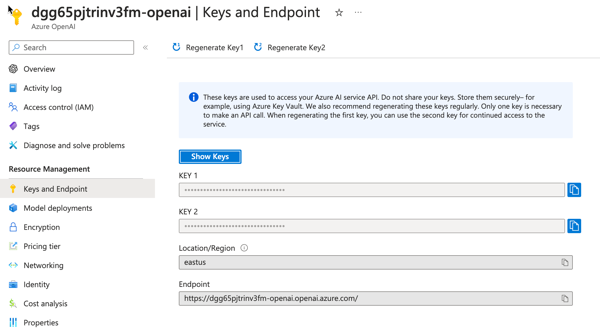

# Explore the Azure OpenAI models and endpoints (console app)

## Azure OpenAI Models

Azure OpenAI is powered by a diverse set of models with different capabilities.

| Model | Description |
| -- | --- |
| GPT-4 | A set of models that improve on GPT-3.5 and can understand and generate natural language and code. |
| GPT-3.5 | A set of models that improve on GPT-3 and can understand and generate natural language and code. |
| Embeddings | A set of models that can convert text into numerical vector form to facilitate text similarity. |
| DALL-E | A series of models that can generate original images from natural language. |
| Whisper | A series of models that can transcribe and translate speech to text. |

### GPT-4 and GPT-3.5 Models

GPT-4 can solve difficult problems with greater accuracy than any of OpenAI's previous models. Like GPT-3.5 Turbo, GPT-4 is optimized for chat and works well for traditional completions tasks.

The GPT-35-Turbo and GPT-4 models are language models that are optimized for conversational interfaces. The models behave differently than the older GPT-3 models. Previous models were text-in and text-out, meaning they accepted a prompt string and returned a completion to append to the prompt. However, the GPT-35-Turbo and GPT-4 models are conversation-in and message-out. The models expect input formatted in a specific chat-like transcript format, and return a completion that represents a model-written message in the chat. While this format was designed specifically for multi-turn conversations, it can also work well for non-chat scenarios too.

### Embeddings

Embeddings, such as the `text-embedding-ada-002` model, measure the relatedness of text strings.

Embeddings are commonly used for the following:

- **Search** - results are ranked by relevance to a query string
- **Clustering** - text strings are grouped by similarity
- **Recommendations** - items with related text strings are recommended
- **Anomaly detection** - outliers with little relatedness are identified
- **Diversity measurement** - similarity distributions are analyzed
- **Classification** - text strings are classified by their most similar label

### DALL-E

DALL-E is a model that can generate an original images from a natural language text description given as input.

### Whisper

Whisper is a speech recognition model, designed for general-purpose applications. Trained on an extensive dataset encompassing diverse audio inputs, and operates as a multi-tasking model capable of executing tasks like multilingual speech recognition, speech translation, and language identification.

## Selecting an LLM

Before a Large Language Model (LLM) can be implemented into a solution, an LLM model must be chosen. For this the business use case and other aspects to the overall goal of the AI solution will need to be defined.

Once the business goals of the solution are known, there are a few key considerations to think about:

- **Business Use Case** - What are the specific tasks the business needs the AI solution to perform? Each LLM is designed for different goals, such as text generation, language translation, image generation, answering questions, code generation, etc.
- **Pricing** - For cases where there may be multiple LLMs to choose from, the [pricing](https://azure.microsoft.com/pricing/details/cognitive-services/openai-service/) of the LLM could be a factor to consider. For example, when choosing between GPT-3.5 or GPT-4, it may be worth to consider that the overall cost of GPT-4 may be higher than GPT-3.5 for the solution since GPT-4 requires more compute power behind the scenes than GPT-3.5
- **Accuracy** - For cases where there may be multiple LLMs to choose from, the comparison of accuracy between them may be a factor to consider. For example, GPT-4 offers improvements over GPT-3.5 and depending on the use case, GPT-4 may provide increased accuracy.
- **Quotas and limits** - The Azure OpenAI service does have [quotas and limits](https://learn.microsoft.com/azure/ai-services/openai/quotas-limits) on using the service. This may affect the performance and pricing of the AI solution. Additionally, some of quotas and limits may vary depending on the Azure Region that is used to host the Azure OpenAI service. The potential impact of these on the pricing and performance of the solution will want to be considered in the design phase of the solution.

## Do I use an out-of-the-box model or a fine-tuned model?

A base model is a model that hasn't been customized or fine-tuned for a specific use case. Fine-tuned models are customized versions of base models where a model's weights are trained on a unique set of prompts. Fine-tuned models achieve better results on a wider number of tasks without needing to provide detailed examples for in-context learning as part of the completion prompt.

The [fine-tuning guide](https://learn.microsoft.com/azure/ai-services/openai/how-to/fine-tuning) can be referenced for more information.

## Explore and use Azure OpenAI models from code

The `key` and `endpoint` necessary to make API calls to Azure OpenAI can be located on **Azure OpenAI** blade in the Azure Portal on the **Keys and Endpoint** pane.

## Lab: Explore and use Azure OpenAI models from code

This labs demonstrates using an Azure OpenAI model to obtain a completion response using Python.

Visit the lab repository to complete [this lab](https://github.com/solliancenet/cosmos-db-openai-nodejs-dev-guide-labs/blob/main/lab_0_explore_and_use_models.ipynb).
