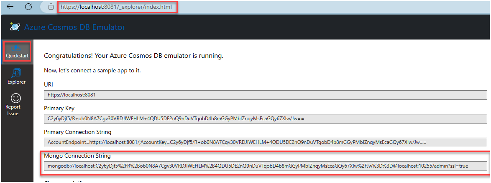

# Create your first Cosmos DB project

This section will cover how to create your first Cosmos DB project. We'll use a notebook to demonstrate the basic CRUD operations. We'll also cover using the Azure Cosmos DB Emulator to test your code locally.

## Emulator support

Azure Cosmos DB has an emulator that you can use to develop your code locally. The emulator supports the API for NoSQL and the API for MongoDB. The use of the emulator does not require an Azure subscription, nor does it incur any costs, so it is ideal for local development and testing. The Azure Cosmos DB emulator can also be utilized with unit tests in a [GitHub Actions CI workflow](https://learn.microsoft.com/en-us/azure/cosmos-db/how-to-develop-emulator?tabs=windows%2Cpython&pivots=api-mongodb#use-the-emulator-in-a-github-actions-ci-workflow).

There is not 100% feature parity between the emulator and the cloud service. Visit the [Azure Cosmos DB emulator](https://learn.microsoft.com/en-us/azure/cosmos-db/emulator) documentation for more details.

For Windows machines, the emulator can be installed via an installer. There is a Windows container using Docker available. However, it does not currently support the API for Mongo DB. A Docker image is also available for Linux that does support the API for Mongo DB.

Learn more about the pre-requisites and installation of the emulator [here](https://learn.microsoft.com/en-us/azure/cosmos-db/how-to-develop-emulator?tabs=windows%2Cpython&pivots=api-mongodb).

>**NOTE**: When using the Azure CosmosDB emulator using the API for MongoDB it must be started with the [MongoDB endpoint options enabled](https://learn.microsoft.com/en-us/azure/cosmos-db/how-to-develop-emulator?tabs=windows%2Cpython&pivots=api-mongodb#start-the-emulator) at the command-line.

**The Azure Cosmos DB emulator does not support vector search. To complete the vector search and AI-related labs, you must use an vCore-based Azure Cosmos DB for MongoDB account in Azure.**

## Authentication

Authentication to Azure Cosmos DB API for Mongo DB uses a connection string. The connection string is a URL that contains the authentication information for your Azure Cosmos DB account or local emulator. The username and password used when provisioning the Azure Cosmos DB API for MongoDB service are used in the connection string when authenticating to Azure.

### Retrieving the connection string from the Cosmos DB Emulator

The splash screen or **Quickstart** section of the Cosmos DB Emulator will display the connection string. Access this screen through the following URL: `https://localhost:8081/_explorer/index.html`.

### Retrieving the connection string from the Azure portal

Retrieve the connection string from the Azure portal by navigating to your Azure Cosmos DB account and selecting the **Connection String** menu item on the left-hand side of the screen. The connection string contains tokens for the username and password that must be replaced with the username and password used when provisioning the Azure Cosmos DB API for MongoDB service.

## Lab 1 - Create your first Cosmos DB for the MongoDB application

Using a notebook, we'll create a Cosmos DB for the MongoDB application in this lab. You can use the Azure Cosmos DB Emulator or an Azure Cosmos DB account in Azure. The following concepts will be covered in this lab:

1. Create a database
2. Create a collection
3. Create a document
4. Read a document
5. Update a document
6. Delete a document
7. Query documents

It is highly recommended that you use a [virtual environment](https://python.land/virtual-environments/virtualenv) for this lab

Please visit the lab repository to complete this lab.
