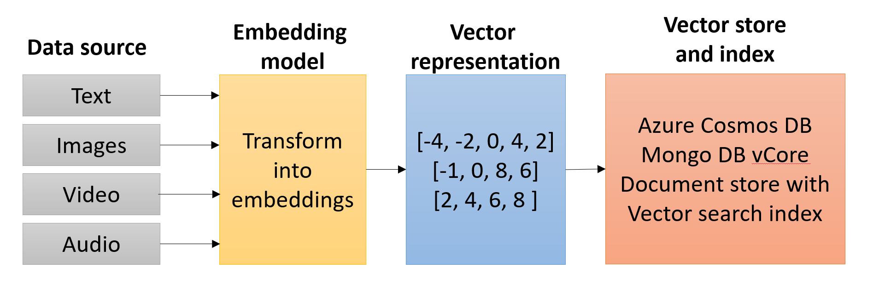
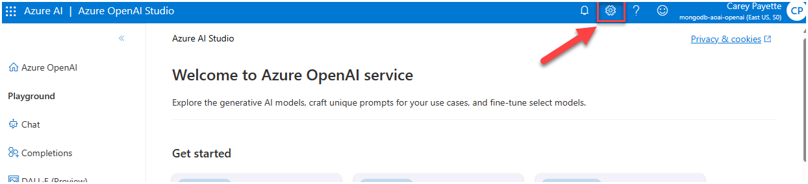
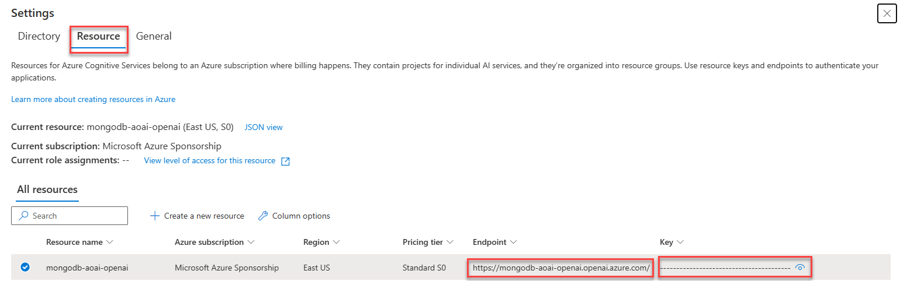

# Use vector search on embeddings in vCore-based Azure Cosmos DB for MongoDB

>**NOTE**: vCore-based Azure Cosmos DB for MongoDB supports vector search on embeddings. This functionality is not supported on RUs-based accounts.

## Embeddings and vector search

Embedding is a way of serializing the semantic meaning of data into a vector representation. Because the generated vector embedding represents the semantic meaning, it means that when it is searched, it can find similar data based on the semantic meaning of the data rather than exact text. Data can come from many sources, including text, images, audio, and video. Because the data is represented as a vector, vector search can, therefore, find similar data across all different types of data.

Embeddings are created by sending data to an embedding model, where it is transformed into a vector, which then can be stored as a vector field within its source document in vCore-based Azure Cosmos DB for MongoDB. vCore-based Azure Cosmos DB for MongoDB supports the creation of vector search indexes on top of these vector fields. A vector search index is a collection of vectors in [latent space](https://idl.cs.washington.edu/papers/latent-space-cartography/) that enables a semantic similarity search across all data (vectors) contained within.



## Why vector search?

Vector search is an important RAG (Retrieval Augmented Generation) pattern component. Large Language Model (LLM) data is trained on a snapshot of public data at a point in time. This data does not contain recent public information, nor does it collect private, corporate information. LLMs are also very broad in their knowledge, and including information from a RAG process can help it focus accurately on a specific domain.

A vector index search allows for a prompt pre-processing step where relevant information can be semantically retrieved from an index and then used to generate a factually accurate prompt for the LLM to reason over. This provides the knowledge augmentation and focus (attention) to the LLM.

In this example, assume textual data is vectorized and stored within an vCore-based Azure Cosmos DB for MongoDB database. The text data and embeddings/vector field are stored in the same document. A vector search index has been created on the vector field. When a message is received from a chat application, this message is also vectorized using the same embedding model (ex., Azure OpenAI text-embedding-ada-002), which is then used as input to the vector search index. The vector search index returns a list of documents whose vector field is semantically similar to the incoming message. The unvectorized text stored within the same document is then used to augment the LLM prompt. The LLM receives the prompt and responds to the requestor based on the information it has been given.


## Why use vCore-based Azure Cosmos DB for MongoDB as a vector store?

It is common practice to store vectorized data in a dedicated vector store as vector search indexing is not a common capability of most databases. However, this introduces additional complexity to the solution as the data must be stored in two different locations. vCore-based Azure Cosmos DB for MongoDB supports vector search indexing, which means that the vectorized data can be stored in the same document as the original data. This reduces the complexity of the solution and allows for a single database to be used for both the vector store and the original data.

## Lab - Use vector search on embeddings in vCore-based Azure Cosmos DB for MongoDB

In this lab, we'll demonstrate how to add an embedding field to a document, create a vector search index, and perform a vector search query. The lab ends with a demonstration of utilizing vector search with an LLM in a RAG scenario using Azure OpenAI.

This lab requires the Azure OpenAI endpoint and access key to be added to the settings (`.env`) file. Access this information by opening [Azure OpenAI Studio](https://oai.azure.com/portal) and selecting the **Gear**/Settings icon located to the right in the top toolbar.



On the **Settings** screen, select the **Resource** tab, then copy and record the **Endpoint** and **Key** values for use in the lab.



>**NOTE**: This lab can only be completed using a deployed vCore-based Azure Cosmos DB for MongoDB account due to the use of vector search. The Azure Cosmos DB Emulator does not support vector search.

This lab also requires the data provided in the previous lab titled [Load data into Azure Cosmos DB API for MongoDB collections](../08_Load_Data/README.md#lab---load-data-into-azure-cosmos-db-api-for-mongodb-collections). Run all cells in this notebook to prepare the data for use in this lab.

Please visit the lab repository to complete [this lab](https://github.com/solliancenet/cosmos-db-openai-nodejs-dev-guide-labs/blob/main/vector_search/README.md).

Some highlights from the lab include:

### Instantiating an AzureOpenAI client

```javascript
const { OpenAIClient, AzureKeyCredential } = require("@azure/openai");

// Instantiate an AzureOpenAI client
const ai_client = new OpenAIClient(
    AOAI_ENDPOINT,
    new AzureKeyCredential(AOAI_KEY)
    )
```

### Vectorizing text using Azure OpenAI

```javascript
//Generate embedding vectors from a text string
async function generateEmbeddings(text) {
    const embeddings = await aoaiClient.getEmbeddings(embeddingsDeploymentName, text);
    // Rest period to avoid rate limiting on Azure OpenAI  
    await new Promise(resolve => setTimeout(resolve, 500));
    return embeddings.data[0].embedding;
}
```

### Adding an embedding field to a document and creating a vector search index on a collection

The lab creates an embedding field named `contentVector` in each collection and populates the value with the vectorized text of the JSON representation of the document.

```javascript
async function addCollectionContentVectorField(db, collectionName) {
    const collection = db.collection(collectionName); 
    const docs = await collection.find({}).toArray();
    const bulkOperations = [];
    console.log(`Generating content vectors for ${docs.length} documents in ${collectionName} collection`);
    for (let i=0; i<docs.length; i++) {
        const doc = docs[i];
        // do not include contentVector field in the content to be embedded
        if ('contentVector' in doc) {
            delete doc['contentVector'];
        }
        const content = JSON.stringify(doc);
        const contentVector = await generateEmbeddings(content);
        bulkOperations.push({
            updateOne: {
                filter: { '_id': doc['_id'] },
                update: { '$set': { 'contentVector': contentVector } },
                upsert: true
            }
        });
        //output progress every 25 documents
        if ((i+1) % 25 === 0 || i === docs.length-1) {          
            console.log(`Generated ${i+1} content vectors of ${docs.length} in the ${collectionName} collection`);
        }
    }
    if (bulkOperations.length > 0) {
        console.log(`Persisting the generated content vectors in the ${collectionName} collection using bulkWrite upserts`);
        await collection.bulkWrite(bulkOperations);
        console.log(`Finished persisting the content vectors to the ${collectionName} collection`);
    }

    //check to see if the vector index already exists on the collection
    console.log(`Checking if vector index exists in the ${collectionName} collection`)
    const vectorIndexExists = await collection.indexExists('VectorSearchIndex');
    if (!vectorIndexExists) {
        await db.command({
            "createIndexes": collectionName,
            "indexes": [
            {
                "name": "VectorSearchIndex",
                "key": {
                "contentVector": "cosmosSearch"
                },
                "cosmosSearchOptions": {                  
                "kind": "vector-ivf",
                "numLists": 1,
                "similarity": "COS",
                "dimensions": 1536
                }
            }
            ]
        });
        console.log(`Created vector index on contentVector field on ${collectionName} collection`);
    }
    else {
        console.log(`Vector index already exists on contentVector field in the ${collectionName} collection`);
    }
}
```

### Performing a vector search query

```javascript
async function vectorSearch(db, collectionName, query, numResults = 3) {
    const collection = db.collection(collectionName);
    // generate the embedding for incoming question
    const queryEmbedding = await generateEmbeddings(query);
    
    const pipeline = [
        {
            '$search': {
                "cosmosSearch": {
                    "vector": queryEmbedding,
                    "path": "contentVector",
                    "k": numResults
                },
                "returnStoredSource": true
            }
        },
        { '$project': { 'similarityScore': { '$meta': 'searchScore' }, 'document': '$$ROOT' } }
    ];
    
    //perform vector search and return the results as an array
    const results = await collection.aggregate(pipeline).toArray();
    return results;
}
```

### Using vector search results with an LLM in a RAG scenario

```javascript
async function ragWithVectorsearch(db, collectionName, question, numResults=3) {
    //A system prompt describes the responsibilities, instructions, and persona of the AI.
    const systemPrompt = `
        You are a helpful, fun and friendly sales assistant for Cosmic Works, a bicycle and bicycle accessories store.
        Your name is Cosmo.
        You are designed to answer questions about the products that Cosmic Works sells.
        
        Only answer questions related to the information provided in the list of products below that are represented
        in JSON format.
        
        If you are asked a question that is not in the list, respond with "I don't know."
        
        List of products:
    `;
    const collection = db.collection(collectionName);
    //generate vector embeddings for the incoming question
    const queryEmbedding = await generateEmbeddings(question);
    //perform vector search and return the results
    results = await vectorSearch(db, collectionName, question, numResults);
    productList = "";
    //remove contentVector from the results, create a string of the results for the prompt
    for (const result of results) {
        delete result['document']['contentVector'];
        productList += JSON.stringify(result['document']) + "\n\n";
    }

    //assemble the prompt for the large language model (LLM)
    const formattedPrompt = systemPrompt + productList;
    //prepare messages for the LLM call, TODO: if message history is desired, add them to this messages array
    const messages = [
        {
            "role": "system",
            "content": formattedPrompt
        },
        {
            "role": "user",
            "content": question
        }
    ];

    //call the Azure OpenAI model to get the completion and return the response
    const completion = await aoaiClient.getChatCompletions(completionsDeploymentName, messages);
    return completion.choices[0].message.content;
}
```
