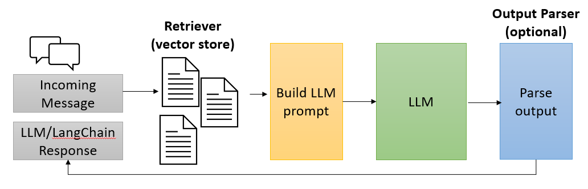

# LangChain

[LangChain](https://www.langchain.com/) is an open-source framework designed to simplify the creation of applications that use large language models (LLMs). LangChain has a vibrant community of developers and contributors and is used by many companies and organizations. LangChain utilizes proven Prompt Engineering patterns and techniques to optimize LLMs, ensuring successful and accurate results through verified and tested best practices.

Part of the appeal of LangChain syntax is the capability of breaking down large complex interactions with LLMs into smaller, more manageable steps by composing a reusable [chain](https://python.langchain.com/docs/modules/chains/) process. LangChain provides a syntax for chains([LCEL](https://python.langchain.com/docs/modules/chains/#lcel)), the ability to integrate with external systems through [tools](https://python.langchain.com/docs/integrations/tools/), and end-to-end [agents](https://python.langchain.com/docs/modules/agents/) for common applications.

The concept of an agent is quite similar to that of a chain in LangChain but with one fundamental difference. A chain in LangChain is a hard-coded sequence of steps executed in a specific order. Conversely, an agent leverages the LLM to assess the incoming request with the current context to decide what steps or actions need to be executed and in what order.

LangChain agents can leverage tools and toolkits. A tool can be an integration into an external system, custom code, or even another chain. A toolkit is a collection of tools that can be used to solve a specific problem.

## LangChain RAG pattern

Earlier in this guide, the RAG (Retrieval Augmented Generation) pattern was introduced. In LangChain, the RAG pattern is implemented as part of a chain that combines a retriever and a Large Language Model (generator). The retriever is responsible for finding the most relevant documents for a given query, in this case, doing a vector search on vCore-based Azure Cosmos DB for MongoDB, and the LLM (generator) is responsible for reasoning over the incoming prompt and context.



When an incoming message is received, the retriever will vectorize the message and perform a vector search to find the most relevant documents for the given query. The retriever returns a list of documents that are then used to augment the prompt. The augmented prompt is then passed to the LLM (generator) to reason over the prompt and context. The output from the LLM is then parsed and returned as the final message.

> **Note**: A vector store retriever is only one type of retriever that can be used in the RAG pattern. Learn more about retrievers in the [LangChain documentation](https://python.langchain.com/docs/modules/data_connection/retrievers/).

## Lab - Vector search and RAG using LangChain

In this lab uses LangChain to re-implement the RAG pattern introduced in the previous lab. Take note of the readability of the code and how easy it is to compose a reusable RAG chain using LangChain that queries the products vector index in vCore-based Azure Cosmos DB for MongoDB. The lab concludes with the creation of an agent with various tools for the LLM to leverage to fulfill the incoming request.

Please visit the lab repository to complete [this lab](hthttps://github.com/solliancenet/cosmos-db-openai-nodejs-dev-guide-labs/tree/main/langchain/README.md).

Some highlights of the lab include:

### Instantiating a vector store reference

```javascript
// set up the MongoDB client
const dbClient = new MongoClient(process.env.AZURE_COSMOSDB_CONNECTION_STRING);

// set up the Azure Cosmos DB vector store
const azureCosmosDBConfig = {
    client: dbClient,
    databaseName: "cosmic_works",
    collectionName: "products",
    indexName: "VectorSearchIndex",
    embeddingKey: "contentVector",
    textKey: "_id"
}
const vectorStore = new AzureCosmosDBVectorStore(new OpenAIEmbeddings(), azureCosmosDBConfig);
```

### Composing a reusable RAG chain

```javascript
async function ragLCELChain(question) {
    // A system prompt describes the responsibilities, instructions, and persona of the AI.
    // Note the addition of the templated variable/placeholder for the list of products and the incoming question.
    const systemPrompt = `
        You are a helpful, fun and friendly sales assistant for Cosmic Works, a bicycle and bicycle accessories store. 
        Your name is Cosmo.
        You are designed to answer questions about the products that Cosmic Works sells.

        Only answer questions related to the information provided in the list of products below that are represented
        in JSON format.

        If you are asked a question that is not in the list, respond with "I don't know."

        Only answer questions related to Cosmic Works products, customers, and sales orders.

        If a question is not related to Cosmic Works products, customers, or sales orders,
        respond with "I only answer questions about Cosmic Works"

        List of products:
        {products}

        Question:
        {question}
    `;
    const retriever = vectorStore.asRetriever();
    const prompt = PromptTemplate.fromTemplate(systemPrompt);

    // The RAG chain will populate the variable placeholders of the system prompt
    // with the formatted list of products based on the documents retrieved from the vector store.
    // The RAG chain will then invoke the LLM with the populated prompt and the question.
    // The response from the LLM is then parsed as a string and returned.
    const ragChain  = RunnableSequence.from([
        {
            products: retriever.pipe(formatDocuments),
            question: new RunnablePassthrough()
        },
        prompt,
        chatModel,
        new StringOutputParser()
    ]);

    return await ragChain.invoke(question);
}
```

### Creating tools for LangChain agents to use

Tools are selected by the Large Language model at runtime. In this case, depending on the incoming user request the LLM will decide which collection in the database to query. The following code shows how to create a tool for the LLM to use to query the products collection in the database.

```javascript
// A tool that retrieves product information from Cosmic Works based on the user's question.
const productsRetrieverTool = new DynamicTool({
    name: "products_retriever_tool",
    description: `Searches Cosmic Works product information for similar products based on the question. 
                Returns the product information in JSON format.`,
    func: async (input) => await retrieverChain.invoke(input),
});
```

### Creating tools that call Python functions

Users may query for information that does not have a semantic meaning, such as an ID GUID value or a SKU number. Providing agents with tools to call Python functions to retrieve documents based on these fields is a common practice. The following is an example of adding tools that call out to Python functions for the products collection.

```javascript
// A tool that will lookup a product by its SKU. Note that this is not a vector store lookup.
const productLookupTool = new DynamicTool({
    name: "product_sku_lookup_tool",
    description: `Searches Cosmic Works product information for a single product by its SKU.
                Returns the product information in JSON format.
                If the product is not found, returns null.`,
    func: async (input) => {
        const db = dbClient.db("cosmic_works");
        const products = db.collection("products");
        const doc = await products.findOne({ "sku": input });            
        if (doc) {                
            //remove the contentVector property to save on tokens
            delete doc.contentVector;
        }
        return doc ? JSON.stringify(doc, null, '\t') : null;
    },
});
```

### Creating an agent armed with tools for vector search and Python functions calling

```javascript
// Define the agent and executor
// An agent is a type of chain that reasons over the input prompt and has the ability
// to decide which function(s) (tools) to use and parses the output of the functions.
const runnableAgent = RunnableSequence.from([  
    {  
        input: (i) => i.input,  
        agent_scratchpad: (i) => formatToOpenAIFunctionMessages(i.steps),  
    },  
    prompt,  
    modelWithFunctions,  
    new OpenAIFunctionsAgentOutputParser(),
]);

// An agent executor can be thought of as a runtime, it orchestrates the actions of the agent
// until completed. This can be the result of a single or multiple actions (one can feed into the next).
// Note: If you wish to see verbose output of the tool usage of the agent, 
//       set returnIntermediateSteps to true
const executor = AgentExecutor.fromAgentAndTools({
    agent: runnableAgent,
    tools,
    returnIntermediateSteps: true
});
```
