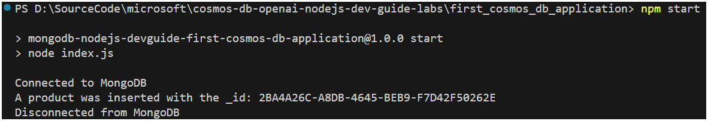
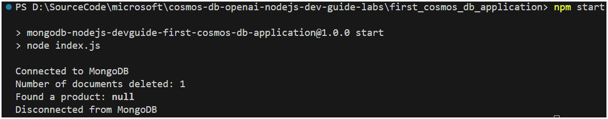
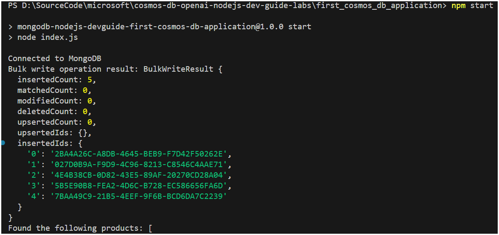
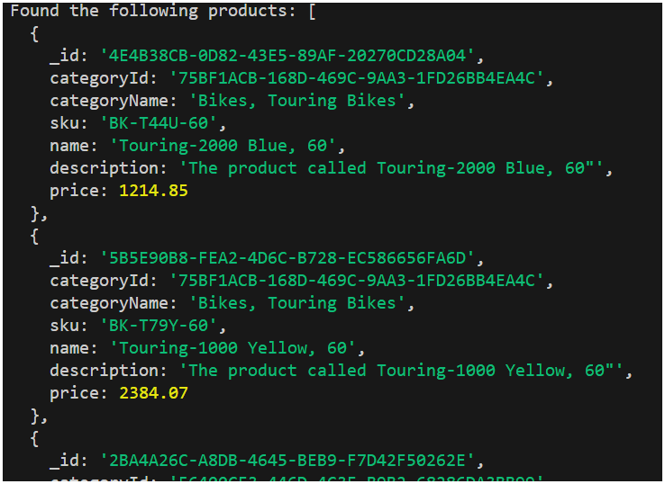

# Lab - Create your first Cosmos DB for MongoDB application

This lab demonstrates the creation of a Cosmos DB for MongoDB application. The lab will cover creating a database client and using that client to create a database, collection, and documents. The lab will also cover querying for documents and updating and deleting documents.

## Create a MongoDB client and connect to the Cosmos DB for MongoDB API service

1. In the lab folder, create a `.env` file and add the following environment variables, replace `<mongodb_uri>` with your Cosmos DB for MongoDB API service connection string:

    ```text
    MONGODB_URI=<mongodb_uri>
    ```

2. In Visual Studio Code, open a terminal window and navigate to the lab folder `first_cosmos_db_application`.

3. Install the required packages by running the following command in the terminal window:

    ```bash
    npm install
    ```

4. Open the `index.js` file, at the top of the file, add the following code to import the MongoDB client from the **mongodb** package:

    ```javascript
    const { MongoClient } = require('mongodb');
    ```

5. In the `main` function, add the following code to initialize the MongoDB client.

    ```javascript
    const client = new MongoClient(process.env.MONGODB_URI);
    ```

6. Directly beneath the client initialization, add the following code to connect to the Cosmos DB for MongoDB database service using the client. This code connects to the database service and outputs messages to the console to indicate the connection status.

    ```javascript
    try {
      await client.connect();
      console.log('Connected to MongoDB');
    } catch (err) {
      console.error(err);
    } finally {
      await client.close();
      console.log('Disconnected from MongoDB');
    }
    ```

7. Verify the code listing in the `index.js` file matches the following code:

    ```javascript
    require('dotenv').config();
    const { MongoClient } = require('mongodb');

    async function main() {    
        const client = new MongoClient(process.env.MONGODB_URI);
        try {
            await client.connect();
            console.log('Connected to MongoDB');
        } catch (err) {
            console.error(err);
        } finally {
            await client.close();
            console.log('Disconnected from MongoDB');
        }
    }
    main().catch(console.error);
    ```

8. Save the changes to the file, and run the application by running the following command in the terminal window. This command will output the connection success and disconnection messages to the console.

    ```bash
    npm start
    ```

    

## Create a MongoDB database

When using the `mongodb` client, the creation of a database is automatic when referenced. No specific api calls to create a database are required, if a database already exists, a reference to the database is returned.

1. In the `index.js` file, after the database connection code, add the following code to obtain a reference to a database. Save the file.

    ```javascript
    const db = client.db('cosmic_works');
    ```

>**Note:**: That the creation of databases and collections are lazy, meaning they will not be created until a document is inserted into a collection. Running the application now will not create the database.

## Create a collection

Creating collections behaves similarly to the database creation. If the collection does not exist, it will be created. It's important to note that databases and collections are lazily created. This means that the database and collection will not be created until the first document is inserted.

1. In the `index.js` file, after the database reference code, add the following code to obtain a reference to a collection. Save the file.

    ```javascript
    const products = db.collection('products');
    ```

>**Note:**: Remember that the creation of databases and collections are lazy, meaning they will not be created until a document is inserted into a collection. Running the application now will not create the database or the collection at this point.

## Create a document

Documents in Cosmos DB API for MongoDB are represented as JSON objects. One method of creating a document is using the `insertOne` method. This method takes a single document and inserts it into the database. This operation returns an [InsertOneResult](https://mongodb.github.io/node-mongodb-native/6.3/interfaces/InsertOneResult.html) object that contains the property **insertedId**. This property contains the unique identifier of the document that was just inserted.

1. In the `index.js` file, after the collection reference code, add the following code to insert a document into the collection. Save the file.

    ```javascript
    const product = {
        _id: '2BA4A26C-A8DB-4645-BEB9-F7D42F50262E',
        categoryId: '56400CF3-446D-4C3F-B9B2-68286DA3BB99',
        categoryName: 'Bikes, Mountain Bikes',  
        sku: 'BK-M18S-42',  
        name: 'Mountain-100 Silver, 42',
        description: 'The product called "Mountain-500 Silver, 42"',
        price: 742.42             
    };
    const result = await products.insertOne(product);
    console.log(`A product was inserted with the _id: ${result.insertedId}`);
    ```

2. Run the application. In addition to the connectivity messages in addition to the document insertion message.

    ```bash
    npm start
    ```

    

3. Return to `index.js` and delete or comment out the code from step 1 of this section. This will ensure that the same record doesn't gets re-added each time the application is run.

## Read a document

The insertion of the product in the previous section automatically created the database and collection. The `findOne` method is used to retrieve a single document from the database. The `findOne` method takes a filter as an argument. This filter is used to find the document in the database. In this case, the filter is the unique identifier or **_id** of the document that was just inserted.

1. In the `index.js` file, after the collection reference code, add the following code to retrieve a document from the collection. Save the file.

    ```javascript
    const product = await products.findOne({ _id: '2BA4A26C-A8DB-4645-BEB9-F7D42F50262E' });
    console.log("Found the product:", product);
    ```

2. Run the application. In addition to the connectivity messages, the document retrieval message will be displayed.

    ```bash
    npm start
    ```

    

## Update a document

The `findOneAndUpdate` method is used to update a single document in the database. This method takes a filter and an update as arguments. The filter is used to find the document to update. The update is a dictionary of the properties to update. In this case, the `findOneAndUpdate` method is used to update the name property of the document. The updated document is the return value for this method.

1. In the `index.js` file, after the collection reference code and before the `findOne` code, add the following code to update a document in the collection. Save the file.

    ```javascript
    const options = { returnDocument: 'after' };
    const updated = await products.findOneAndUpdate(
        { _id: '2BA4A26C-A8DB-4645-BEB9-F7D42F50262E' },
        { $set: { price: 14242.42 } },
        options);
    ```

2. Run the application. In addition to the connectivity messages, the document retrieved message will be displayed with the updated price.

    ```bash
    npm start
    ```

    

3. Remove the code that was just added in this section from the `index.js` file and save the file.

## Delete a document

The `deleteOne` method is used to delete a single document from the database. This method takes a filter as an argument. This filter is used to find the document to delete. In this case, the filter is the unique identifier or `_id` of the document that was just inserted and updated. The `deleteOne` method returns a [`DeleteResult`](https://mongodb.github.io/node-mongodb-native/6.3/interfaces/DeleteResult.html) object.

1. In the `index.js` file, after the collection reference code and before the `findOne` code, add the following code to delete a document from the collection. Save the file.

    ```javascript
    const result = await products.deleteOne({ _id: '2BA4A26C-A8DB-4645-BEB9-F7D42F50262E' });
    console.log(`Number of documents deleted: ${result.deletedCount}`);
    ```

2. Run the application. In addition to the connectivity messages, the document deletion message will be displayed. Note the retrieval message displays `null` as the document was deleted.

    ```bash
    npm start
    ```

    

3. Remove the code that was just added in this section, as well as the `findOne` code from the `index.js` file and save the file.

## Query for multiple documents

In this section, multiple product documents are written to the database using a `bulkWrite` operation. Bulk operations will be covered in more detail in the next lab. Having multiple documents in the products collection will allow for querying for multiple documents using the `find` method. This method takes a filter as an argument. This filter is used to find the documents to return. In this case, the filter is empty and therefore will return all documents in the collection. The `find` method returns a cursor that can be converted to an array of documents using the `toArray` method.

1. In the `index.js` file, add the following code to insert multiple product documents in the database. Place this code directly beneath the collection reference code.

    ```javascript
        const productsToInsert = [
        {
            _id: "2BA4A26C-A8DB-4645-BEB9-F7D42F50262E",    
            categoryId: "56400CF3-446D-4C3F-B9B2-68286DA3BB99", 
            categoryName: "Bikes, Mountain Bikes", 
            sku:"BK-M18S-42",
            name: "Mountain-100 Silver, 42",
            description: 'The product called "Mountain-500 Silver, 42"',
            price: 742.42
        },
        {
            _id: "027D0B9A-F9D9-4C96-8213-C8546C4AAE71",    
            categoryId: "26C74104-40BC-4541-8EF5-9892F7F03D72", 
            categoryName: "Components, Saddles", 
            sku: "SE-R581",
            name: "LL Road Seat/Saddle",
            description: 'The product called "LL Road Seat/Saddle"',
            price: 27.12
        },
        {
            _id: "4E4B38CB-0D82-43E5-89AF-20270CD28A04",
            categoryId: "75BF1ACB-168D-469C-9AA3-1FD26BB4EA4C",
            categoryName:  "Bikes, Touring Bikes",
            sku: "BK-T44U-60",
            name: "Touring-2000 Blue, 60",
            description: 'The product called Touring-2000 Blue, 60"',
            price: 1214.85
        },
        {
            _id: "5B5E90B8-FEA2-4D6C-B728-EC586656FA6D",
            categoryId: "75BF1ACB-168D-469C-9AA3-1FD26BB4EA4C",
            categoryName: "Bikes, Touring Bikes",
            sku: "BK-T79Y-60",
            name: "Touring-1000 Yellow, 60",
            description: 'The product called Touring-1000 Yellow, 60"',
            price: 2384.07
        },
        {
            _id: "7BAA49C9-21B5-4EEF-9F6B-BCD6DA7C2239",
            categoryId: "26C74104-40BC-4541-8EF5-9892F7F03D72",
            categoryName: "Components, Saddles",
            sku: "SE-R995",
            name: "HL Road Seat/Saddle",
            description: 'The product called "HL Road Seat/Saddle"',
            price: 52.64,
        }
    ]
    const result = await products.bulkWrite(
        productsToInsert.map((product) => ({
            insertOne: {
                document: product
            }
        }))
    );
    console.log("Bulk write operation result:", result);
    ```

2. Immediately following the preceding code, add the following code to query for multiple documents in the collection. Save the file.

    ```javascript
    const allProducts = await products.find({}).toArray();
    console.log("Found the following products:", allProducts);
    ```

3. Run the application. In addition to the connectivity messages, the bulk write operation result showing the inserted id values and the retrieval of all documents output to the console.

    ```bash
    npm start
    ```

    

    

4. Remove all code added in this section, and save the `index.js` file.

## Clean up resources

Clean up the items created in this lab by deleting the MongoDB database.

1. In `index.js`, add the following code after the collection reference code to delete the database. Save the file.

    ```javascript
    await db.dropDatabase();
    console.log("The database has been dropped");
    ```

2. Run the application. In addition to the connectivity messages, the database deletion message will be displayed.

    ```bash
    npm start
    ```

    
