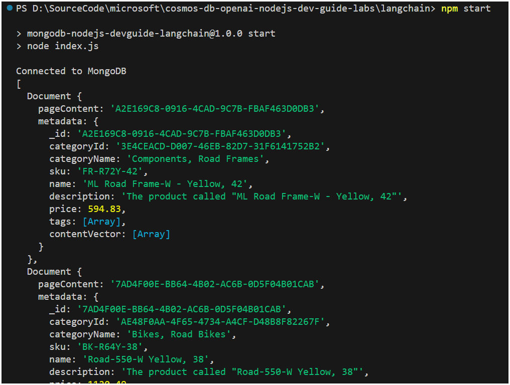
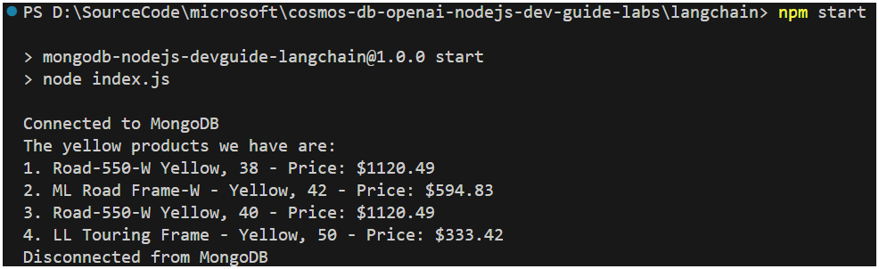
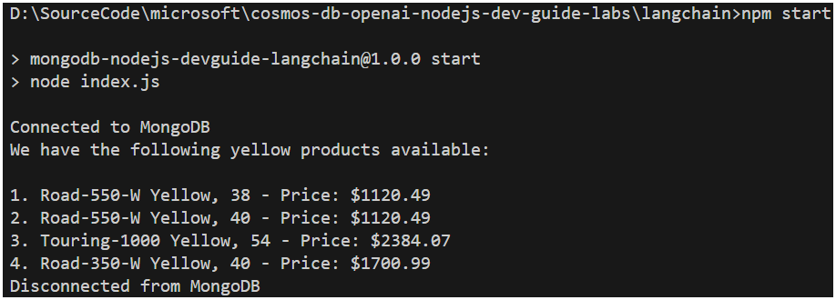
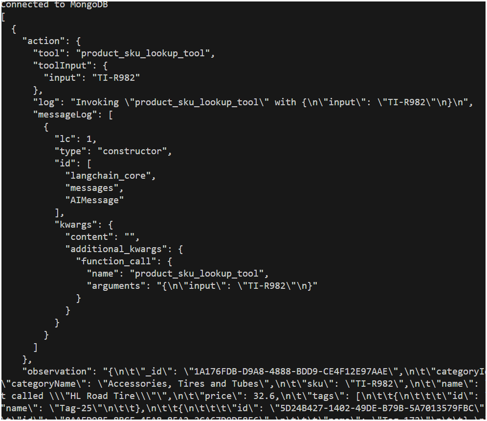

# Lab - LangChain

In the previous lab, the `mongodb` package was used to perform a vector search through a db command to find product documents that were most similar to the user's input. In this lab, you will use the LangChain package to perform the same search. LangChain has a vector store class named `AzureCosmosDBVectorStore`, a community contribution, that supports vector search in vCore-based Azure Cosmos DB for MongoDB.

The `AzureCosmosDBVectorStore` class represents a single vector index in the database, therefore for the instructions for this lab will focus on the `products` collection, however the same steps can be used with the `customers` and `sales` collections as well.

Throughout this lab, notice how much more concise the code is compared to the previous lab with the addition of LangChain.

## Setup the lab environment

To simplify code, the LangChain package makes use of environment variables. The `.env` file in this lab will reflect the naming conventions of the LangChain packages and differs from previous labs.

1. Open the `.env` file in the Visual Studio Code editor.

2. Add the following settings to the `.env` file, populating the MongoDB connection string and replacing the values from the deployed Azure OpenAI service:

    ```bash
    AZURE_COSMOSDB_CONNECTION_STRING=<mongodb_uri>
    AZURE_OPENAI_API_INSTANCE_NAME=<openai-service-name>
    AZURE_OPENAI_API_KEY=<azure_openai_api_key>
    AZURE_OPENAI_API_DEPLOYMENT_NAME=completions
    AZURE_OPENAI_API_EMBEDDINGS_DEPLOYMENT_NAME=embeddings
    AZURE_OPENAI_API_VERSION=2023-09-01-preview
    ```

    Replace `<mongodb_uri>` with the MongoDB connection string. Replace `<openai-service-name>` with the name of the deployed OpenAI service, and `<azure_openai_api_key>` with the Azure OpenAI API key. Leave all other values untouched.

    >**Note**: The Azure OpenAI service name is not the full endpoint. Only the service name is required. For example, if the endpoint is `https://myservicename.openai.azure.com/`, then the service name is `myservicename`.

3. In Visual Studio Code, open a terminal window and navigate to the lab folder `langchain`.

4. Install the required packages by running the following command in the terminal window:

    ```bash
    npm install
    ```

## Pre-requisites

This lab expects that data is already loaded into the Azure Cosmos DB API for MongoDB collections, and the `contentVector` field is populated (along with a vector index created). You can run the `catch_up.js` script to load sample data, generate/populate the `contentVector` field and create the vector search index in each collection.

>**Note**: This script will take a few minutes to run. This script will load data, generate the `contentVector` field, and create the vector index in the `products` collection only. This `products` collection is the focus of the instructions provided in this lab.

1. In the Visual Studio Code terminal, ensure you are in the `langchain` lab directory.

2. Run the `catch_up.js` script to satisfy the lab pre-requisites.

    ```bash
    node catch_up.js
    ```

## Vector search with LangChain

The first step is to initialize the connection to the vector store. The `AzureCosmosDBVectorStore` class is used to represent the vector store. This section will walk through the initialization of this connection as well as a test call that issues a vector search and outputs the results.

When establishing the connection to the vector store (vCore-based Azure Cosmos DB for MongoDB), recall that in the previous lab, each collection was populated and a `contentVector` field added that contains the vectorized embeddings of the document itself. Finally, a vector index was also created on the `contentVector` field to enable vector search. The vector index in each collection is named `VectorSearchIndex`.

The return value of a vector search in LangChain is a list of `Document` objects. The LangChain `Document` class contains two properties: `pageContent`, that represents the textual content that is typically used to augment the prompt, and `metadata` that contains all other attributes of the document. In the cell below, we'll use the `_id` field as the `pageContent`, and the rest of the fields are returned as metadata.

1. Open the `index.js` file in the Visual Studio Code editor.

2. Directly beneath the line `const { MongoClient } = require('mongodb');`, add the following code to import the necessary LangChain packages. This code imports the AzureCosmosDBVectorStore that represents the vector index in a collection, the `AzureCosmosDBSimilarityType` that will allow us to perform a vector search using cosine similarity, and the `OpenAIEmbeddings` class that will be used to generate the embeddings for the user's input for the vector search.

    ```javascript
    const { AzureCosmosDBVectorStore
        AzureCosmosDBSimilarityType
    } = require("@langchain/community/vectorstores/azure_cosmosdb")
    const { OpenAIEmbeddings } = require("@langchain/openai")
    ```

3. Directly beneath the line of code that sets up the MongoDB connection `const dbClient = new MongoClient(process.env.AZURE_COSMOSDB_CONNECTION_STRING);`, add the following code to initialize the connection to the vector store that points to the `products` collection and associated index. The `OpenAIEmbeddings` uses the default values obtained from the environment variables to initialize.

    ```javascript
    // set up the Azure Cosmos DB vector store using the initialized MongoDB client
    const azureCosmosDBConfig = {
        client: dbClient,
        databaseName: "cosmic_works",
        collectionName: "products",
        indexName: "VectorSearchIndex",
        embeddingKey: "contentVector",
        textKey: "_id"
    }
    const vectorStore = new AzureCosmosDBVectorStore(new OpenAIEmbeddings(), azureCosmosDBConfig);
    ```

4. In the `main` function, directly beneath the line of code `console.log("Connected to MongoDB");`, append the following code that will perform a vector search using the `vectorStore` object and output the results.

    ```javascript
    // perform a vector search using the vector store
    const results = await vectorStore.similaritySearch(
        "What yellow products do you have?", 
        AzureCosmosDBSimilarityType.CosineSimilarity, 
        3
    );
    console.log(results);
    ```

5. Save the `index.js` file.

6. Run the application by executing the following command in the terminal window:

    ```bash
    npm start
    ```

    The output will be a list of `Document` objects that contain the metadata of the documents that are most similar to the user's input.

    >**Note**: The `Document` objects contain the `page_content` and `metadata` properties. The `page_content` is the `_id` field of the document, and the `metadata` contains all other fields of the document.

    

7. Delete or comment out the code added in step 4.

8. Save the `index.js` file.

## RAG with LangChain

In this section, we'll implement the RAG pattern using LangChain. In LangChain, a **retriever** is used to augment the prompt with contextual data. In this case, the already established vector store will be used as the retriever. By default, the prompt is augmented with the `pageContent` field of the retrieved document that customarily contains the text content of the embedded vector. In our case, the document itself serves as the textual content, so we'll have to do some pre-processing to format the text of the product list that is expected in our system prompt (JSON string) - see the `formatDocuments` function below for this implementation.

We'll also define a reusable RAG chain to control the flow and behavior of the call into the LLM. This chain is defined using the LCEL syntax (LangChain Expression Language).

1. Open the `index.js` file in the Visual Studio Code editor.

2. Directly preceding the final line of code in this file (where the main function is called), add the `formatDocuments` function that will be used to format the `Document` objects into a JSON string that will be used in the prompt for the LLM. The code is documented inline.

    ```javascript
    function formatDocuments(docs) {
        // Prepares the product list for the system prompt.  
        let strDocs = "";
        for (let index = 0; index < docs.length; index++) {
            let doc = docs[index];
            let docFormatted = { "_id": doc.pageContent };
            Object.assign(docFormatted, doc.metadata);

            // Build the product document without the contentVector and tags
            if ("contentVector" in docFormatted) {
                delete docFormatted["contentVector"];
            }
            if ("tags" in docFormatted) {
                delete docFormatted["tags"];
            }

            // Add the formatted product document to the list
            strDocs += JSON.stringify(docFormatted, null, '\t');

            // Add a comma and newline after each item except the last
            if (index < docs.length - 1) {
                strDocs += ",\n";
            }
        }
        // Add two newlines after the last item
        strDocs += "\n\n";
        return strDocs;
    }
    ```

3. In the `require("@langchain/openai")` import statement, add the `ChatOpenAI` class that will be used to interact with the LLM.

    ```javascript
    const { OpenAIEmbeddings, ChatOpenAI } = require("@langchain/openai")
    ```

4. Directly beneath the line of code that was just modified in the previous step, add the following:

    ```javascript
    // To support the LangChain LCEL RAG chain
    const { PromptTemplate }  = require("@langchain/core/prompts")
    const { RunnableSequence, RunnablePassthrough } = require("@langchain/core/runnables")
    const { StringOutputParser } = require("@langchain/core/output_parsers")
    ```

5. Immediately before the `async function main()` function, add the following code to initialize an Azure OpenAI chat model.

    ```javascript
    // set up the OpenAI chat model
    const chatModel = new ChatOpenAI();
    ```

6. Before the last line of code in the file (that calls the main function), add the following function that creates a reusable LangChain RAG chain. The code is documented inline.

    ```javascript
    async function ragLCELChain(question) { 
        // A system prompt describes the responsibilities, instructions, and persona of the AI.
        // Note the addition of the templated variable/placeholder for the list of products and the incoming question.
        const systemPrompt = `
            You are a helpful, fun and friendly sales assistant for Cosmic Works, a bicycle and bicycle accessories store. 
            Your name is Cosmo.
            You are designed to answer questions about the products that Cosmic Works sells.

            Only answer questions related to the information provided in the list of products below that are represented
            in JSON format.

            If you are asked a question that is not in the list, respond with "I don't know."

            Only answer questions related to Cosmic Works products, customers, and sales orders.

            If a question is not related to Cosmic Works products, customers, or sales orders,
            respond with "I only answer questions about Cosmic Works"

            List of products:
            {products}

            Question:
            {question}
        `;

        // Use a retriever on the Cosmos DB vector store
        const retriever = vectorStore.asRetriever();

        // Initialize the prompt
        const prompt = PromptTemplate.fromTemplate(systemPrompt);

        // The RAG chain will populate the variable placeholders of the system prompt
        // with the formatted list of products based on the documents retrieved from the vector store.
        // The RAG chain will then invoke the LLM with the populated prompt and the question.
        // The response from the LLM is then parsed as a string and returned.
        const ragChain  = RunnableSequence.from([
            {
                products: retriever.pipe(formatDocuments),
                question: new RunnablePassthrough()
            },
            prompt,
            chatModel,
            new StringOutputParser()
        ]);

        return await ragChain.invoke(question);
    }
    ```

7. In the `main` function, directly beneath the line of code `console.log('Connected to MongoDB');`, add the following code that will call the `ragLCELChain` function to perform a vector search using the `vectorStore` object and output the results.

    ```javascript
    console.log(await ragLCELChain("What yellow products do you have?"));
    ```

8. Save the `index.js` file.

9. Run the application by executing the following command in the terminal window:

    ```bash
    npm start
    ```

    

10. Delete or comment out the code added in step 7.

11. Save the `index.js` file.

## LangChain agent

In this section, we'll implement a LangChain agent that will be used to interact with the LLM. The agent will be used to control the flow and behavior of the call into the LLM. An agent differs from the previous RAG chain in that the RAG chain is a definition of a sequence of specific actions. Agents on the other hand are equipped with various tools and will determine which actions to take based on the context of the conversation. In this scenario, an agent will be equipped with two tools, one that uses a retriever chain from the vector store, and another that will perform a MongoDB lookup based on a SKU value. The reason the SKU lookup tool is introduced is because the vector store is built for semantic search. Some fields, such as the `_id` or `sku` fields do not have semantic meaning and therefore a direct lookup is more appropriate.

1. Open the `index.js` file in the Visual Studio Code editor.

2. Immediately after the `const { StringOutputParser } = require("@langchain/core/output_parsers");` line of code, add the following dependencies to support the creation of the LangChain agent:

    ```javascript
    // For LangChain agent
    const { DynamicTool } = require("@langchain/core/tools");
    const { AgentExecutor } = require("langchain/agents");
    const { MessagesPlaceholder, ChatPromptTemplate } = require("@langchain/core/prompts");
    const { convertToOpenAIFunction } = require("@langchain/core/utils/function_calling");
    const { OpenAIFunctionsAgentOutputParser } = require("langchain/agents/openai/output_parser");
    const { formatToOpenAIFunctionMessages } = require("langchain/agents/format_scratchpad");
    ```

3. Immediately before the last line of code in the file (that calls the main function), add the following function that builds a LangChain agent executor and a helper function that will invoke the agent. The code is documented inline.

    ```javascript
    async function buildAgentExecutor() {
        // A system prompt describes the responsibilities, instructions, and persona of the AI.
        // Note the variable placeholders for the list of products and the incoming question are not included.
        // An agent system prompt contains only the persona and instructions for the AI.
        const systemMessage = `
                You are a helpful, fun and friendly sales assistant for Cosmic Works, a bicycle and bicycle accessories store.
        
                Your name is Cosmo.
        
                You are designed to answer questions about the products that Cosmic Works sells, the customers that buy them, and the sales orders that are placed by customers.
        
                If you don't know the answer to a question, respond with "I don't know."
                
                Only answer questions related to Cosmic Works products, customers, and sales orders.
                
                If a question is not related to Cosmic Works products, customers, or sales orders,
                respond with "I only answer questions about Cosmic Works"          
            `;

        // Create vector store retriever chain to retrieve documents and formats them as a string for the prompt.
        const retrieverChain = vectorStore.asRetriever().pipe(formatDocuments);

        // Define tools for the agent can use, the description is important this is what the AI will 
        // use to decide which tool to use.

        // A tool that retrieves product information from Cosmic Works based on the user's question.
        const productsRetrieverTool = new DynamicTool({
            name: "products_retriever_tool",
            description: `Searches Cosmic Works product information for similar products based on the question. 
                        Returns the product information in JSON format.`,
            func: async (input) => await retrieverChain.invoke(input),
        });

        // A tool that will lookup a product by its SKU. Note that this is not a vector store lookup.
        const productLookupTool = new DynamicTool({
            name: "product_sku_lookup_tool",
            description: `Searches Cosmic Works product information for a single product by its SKU.
                        Returns the product information in JSON format.
                        If the product is not found, returns null.`,
            func: async (input) => {
                const db = dbClient.db("cosmic_works");
                const products = db.collection("products");
                const doc = await products.findOne({ "sku": input });            
                if (doc) {                
                    //remove the contentVector property to save on tokens
                    delete doc.contentVector;
                }
                return doc ? JSON.stringify(doc, null, '\t') : null;
            },
        });

        // Generate OpenAI function metadata to provide to the LLM
        // The LLM will use this metadata to decide which tool to use based on the description.
        const tools = [productsRetrieverTool, productLookupTool];
        const modelWithFunctions = chatModel.bind({
            functions: tools.map((tool) => convertToOpenAIFunction(tool)),
        });

        // OpenAI function calling is fine-tuned for tool using therefore you don't need to provide instruction.
        // All that is required is that there be two variables: `input` and `agent_scratchpad`.
        // Input represents the user prompt and agent_scratchpad acts as a log of tool invocations and outputs.
        const prompt = ChatPromptTemplate.fromMessages([
            ["system", systemMessage],
            ["human", "{input}"],
            new MessagesPlaceholder(variable_name="agent_scratchpad")
        ]);

        // Define the agent and executor
        // An agent is a type of chain that reasons over the input prompt and has the ability
        // to decide which function(s) (tools) to use and parses the output of the functions.
        const runnableAgent = RunnableSequence.from([  
            {  
                input: (i) => i.input,  
                agent_scratchpad: (i) => formatToOpenAIFunctionMessages(i.steps),  
            },  
            prompt,  
            modelWithFunctions,  
            new OpenAIFunctionsAgentOutputParser(),
        ]);

        // An agent executor can be thought of as a runtime, it orchestrates the actions of the agent
        // until completed. This can be the result of a single or multiple actions (one can feed into the next).
        // Note: If you wish to see verbose output of the tool usage of the agent, 
        //       set returnIntermediateSteps to true
        const executor = AgentExecutor.fromAgentAndTools({
            agent: runnableAgent,
            tools,
            //returnIntermediateSteps: true
        });

        return executor;
    }

    // Helper function that executes the agent with user input and returns the string output
    async function executeAgent(agentExecutor, input) {
        // Invoke the agent with the user input
        const result = await agentExecutor.invoke({input});
        
        // Output the intermediate steps of the agent if returnIntermediateSteps is set to true
        if (agentExecutor.returnIntermediateSteps) {
            console.log(JSON.stringify(result.intermediateSteps, null, 2));
        }
        // Return the final response from the agent
        return result.output;
    }
    ```

4. In the `main` function, directly beneath the line of code `console.log('Connected to MongoDB');`, add the following code that will call the `buildAgentExecutor` function to create the LangChain agent executor and the `executeAgent` function to engage with the agent and outupt the results.

    ```javascript
    const agentExecutor = await buildAgentExecutor();
    console.log(await executeAgent(agentExecutor, "What yellow products do you have?"));
    ```

5. Save the `index.js` file.

6. Run the application by executing the following command in the terminal window:

    ```bash
    npm start
    ```

    

7. Change the question in the `executeAgent` function to `What is the name of the product that has the SKU TI-R982?`.

8. Find the commented line of code `//returnIntermediateSteps: true` in the `executeAgent` function and uncomment it to enable verbose output of the tool usage of the agent. This will output the intermediate steps of the agent that includes the function calls and their outputs.

9. Save the `index.js` file.

10. Run the application by executing the following command in the terminal window:

    ```bash
    npm start
    ```

    

    Notice the verbose output includes the selection, input, and observation(output) of the tool used by the agent.

11. If desired, comment out the line of code `//returnIntermediateSteps: true` in the `executeAgent` function to disable verbose output of the tool usage of the agent.

12. Experiment with additional questions of your own.

## Summary

In this lab, you used the LangChain package to perform a vector search in vCore-based Azure Cosmos DB for MongoDB. You initialized the connection to the vector store, performed a vector search, implemented the RAG pattern using LangChain, and created a LangChain agent. You also experimented with the LangChain agent and observed the verbose output of the tool usage of the agent.
