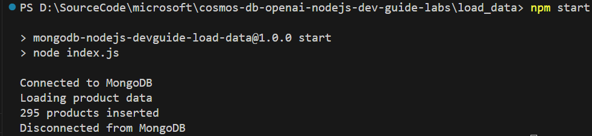
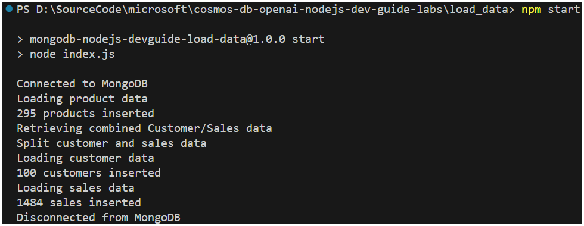

# Lab - Load data into Cosmos DB using the MongoDB API

This lab demonstrates bulk loading of data from the Cosmic Works JSON files into Cosmos DB for MongoDB.

## Setup the lab environment

1. In the lab folder, create a `.env` file and add the following environment variables, replace `<mongodb_uri>` with your Cosmos DB for MongoDB API service connection string:

    ```text
    MONGODB_URI=<mongodb_uri>
    ```

2. In Visual Studio Code, open a terminal window and navigate to the lab folder `load_data`.

3. Install the required packages by running the following command in the terminal window:

    ```bash
    npm install
    ```

## Bulk load product data

There is more than one option when performing bulk operations in Cosmos DB for MongoDB. In this section, data will be loaded using the `bulkWrite` method. The `bulkWrite` method is used to perform multiple write operations in a single batch, write operations can include a mixture of insert, update, and delete operations.

1. Open the `index.js` file, and directly beneath the `const db = client.db('cosmic_works');` line, add the following code to fetch the product data from the Cosmic Works repository:

    ```javascript
    // Load product data
    console.log('Loading product data')
    // Initialize the product collection pointer (will automatically be created if it doesn't exist)
    const productCollection = db.collection('products');
    // Load the product data from the raw data from Cosmic Works while also removing the system properties
    const productRawData = "https://cosmosdbcosmicworks.blob.core.windows.net/cosmic-works-small/product.json";
    const productData = (await (await fetch(productRawData)).json())
                            .map(prod => cleanData(prod));
    ```

2. Optionally, append the following code (to the code in the previous step) to delete any existing products in the collection. This helps if the application is run multiple times so there is no duplicates.

    ```javascript
    // Delete any existing products
    console.log('Deleting existing products');
    await productCollection.deleteMany({});
    ```

3. Append the following code (to the code in the previous step) to bulk load the product data into the collection:

    ```javascript
    var result = await productCollection.bulkWrite(
            productData.map((product) => ({
                insertOne: {
                    document: product
                }
            }))
        );
    console.log(`${result.insertedCount} products inserted`);
    ```

4. Save the `index.js` file.

5. Run the application by executing the following command in the terminal window:

    ```bash
    npm start
    ```

    

## Bulk load of customer and sales data

In this section, data will be loaded using the `insertMany` method. The `insertMany` method is used to insert multiple documents into a collection, it differs from the `bulkWrite` method in that it only supports insert operations.

Customer data and sales data are also combined in a single JSON source, some pre-processing is required to separate the data into two separate collections.

1. Open the `index.js` file, and directly beneath the code for adding products, append the following code to fetch the customer and sales data from the Cosmic Works repository:

    ```javascript
    // Load customer and sales data
    console.log('Retrieving combined Customer/Sales data');
    const customerCollection = db.collection('customers');
    const salesCollection = db.collection('sales');
    const custSalesRawData = "https://cosmosdbcosmicworks.blob.core.windows.net/cosmic-works-small/customer.json";
    const custSalesData = (await (await fetch(custSalesRawData)).json())
                            .map(custSales => cleanData(custSales));
    ```

2. Split the customer data from the sales data by appending the following code (to the code in the previous step):

    ```javascript
    console.log("Split customer and sales data");
    const customerData = custSalesData.filter(cust => cust["type"] === "customer");
    const salesData = custSalesData.filter(sales => sales["type"] === "salesOrder");
    ```

3. Append the following code (to the code in the previous step) to bulk load the customer data into the collection using the `insertMany` method:

    ```javascript
    console.log("Loading customer data");
    await customerCollection.deleteMany({});
    result = await customerCollection.insertMany(customerData);
    console.log(`${result.insertedCount} customers inserted`);
    ```

4. Append the following code (to the code in the previous step) to bulk load the sales data into the collection using the `insertMany` method:

    ```javascript
    console.log("Loading sales data");
    await salesCollection.deleteMany({});
    result = await salesCollection.insertMany(salesData);
    console.log(`${result.insertedCount} sales inserted`);
    ```

5. Save the `index.js` file.

6. Run the application by executing the following command in the terminal window:

    ```bash
    npm start
    ```

    

## Summary

In this section bulk load operations were used to load product, customer, and sales data into Cosmos DB for MongoDB. Keep the database and its loaded data for use in subsequent labs.
